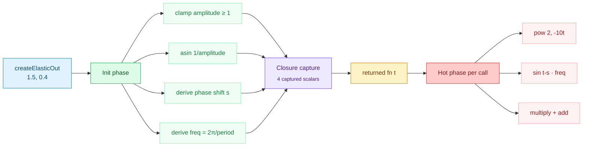
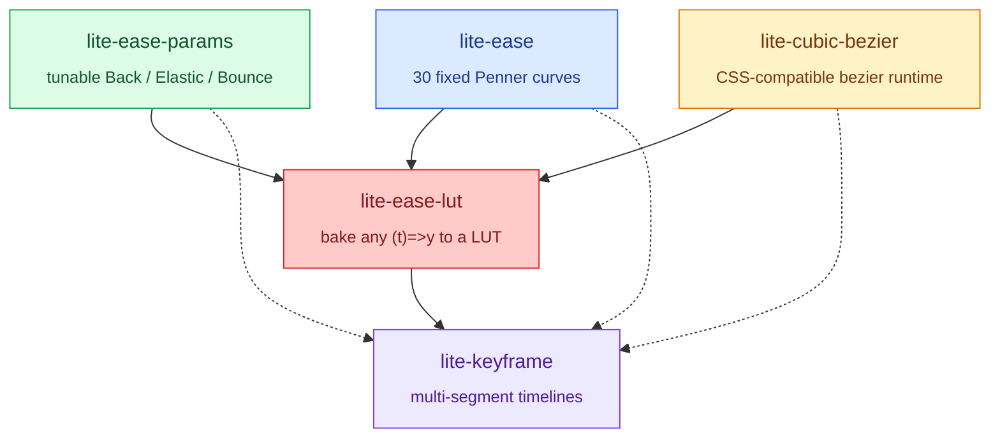

# @zakkster/lite-ease-params

[](https://www.npmjs.com/package/@zakkster/lite-ease-params)
[](https://bundlephobia.com/result?p=@zakkster/lite-ease-params)
[](https://www.npmjs.com/package/@zakkster/lite-ease-params)
[](https://www.npmjs.com/package/@zakkster/lite-ease-params)


[](https://opensource.org/licenses/MIT)

## 🎚️ What is lite-ease-params?

`@zakkster/lite-ease-params` is the **tunable parametric easing layer** for the Lite ecosystem. Where [`@zakkster/lite-ease`](https://www.npmjs.com/package/@zakkster/lite-ease) ships fixed Penner curves as `(t) => t` functions, this package ships **factories** that let you tune the *character* of Back, Elastic, and Bounce curves: how deep the overshoot dips, how fast the elastic oscillates, how bouncy the bounce settles.

It gives you:

- 🎯 **9 factories** — Back, Elastic, Bounce × In/Out/InOut
- 🎛️ **Real parameters** — `overshoot`, `amplitude`, `period`, `bounciness`
- 🧮 **Codegen pattern** — one allocation at factory time, **zero allocations in the hot path**
- ⚡ **Trig hoisting** — `asin`, divisions, and breakpoints all computed once at closure init
- 📐 **Bit-exact Penner default** — `createBounceOut()` returns a cached closure that reproduces the canonical Penner curve identically
- 0️⃣ **Zero dependencies**, pure ES module, `sideEffects: false`
- 🪶 **< 2 KB minified** (entire library; tree-shakeable per factory)

## 📐 Why a separate package?

Most easing libraries ship the *shape* of a curve but not the *knob* on it. Penner's `easeOutBack` overshoot is hard-coded at `1.70158`. `easeOutBounce` always uses `7.5625 / 2.75`. If you want a snappier overshoot or a slower-settling bounce, you're either rewriting Penner's math or pulling in a 30 KB tween engine.

The naive way to add parameters is to take them on every call:

```js
// ❌ Recomputes asin, divisions, and breakpoints on EVERY tick.
function easeOutElastic(t, amplitude, period) {
    const s = Math.asin(1 / amplitude) * (period / (2 * Math.PI));
    const freq = (2 * Math.PI) / period;
    // ... per-call math
}
```

`lite-ease-params` uses the **codegen pattern**: each factory captures the parameter-derived invariants once, then returns a tight `(t) => y` closure whose body is only the math the curve fundamentally requires.

```js
// ✅ asin, divisions, breakpoints computed ONCE, when factory is called.
const easeOutElastic = createElasticOut(1.5, 0.4);

// Per-frame: just `pow * sin + 1`. No allocations. No recomputation.
const y = easeOutElastic(t);
```

For an animation engine running 60–120 fps with hundreds of tweens, this is the difference between thrashing the GC and steady-state silence.

## 📊 Comparison

| Library | Tunable? | Allocations per call | Default-Penner exact? | Bundle | Approach |
|---|---|---|---|---|---|
| `gsap` (CustomEase) | ✅ via SVG path | Some | N/A (custom) | ~30 KB | full tween engine |
| `popmotion` (`createGenerator`) | ✅ | Closure per call | N/A | ~7 KB | dynamic generator |
| `bezier-easing` | Cubic-bezier only | 0 (after init) | N/A (CSS bezier) | ~1 KB | Newton solver |
| `@tweenjs/tween.js` | ❌ (fixed Penner) | 0 | ✅ | ~9 KB | bundled with engine |
| `d3-ease` | ❌ (fixed) | 0 | ✅ | ~2 KB | static Penner |
| `eases` | ❌ (fixed) | 0 | ✅ | ~2 KB | static Penner |
| **`lite-ease-params`** | **✅ Back / Elastic / Bounce** | **0 in hot path** | **✅ bit-exact at default bounciness** | **< 2 KB** | **codegen factories** |

## 🚀 Quick start

```bash
npm install @zakkster/lite-ease-params
```

```javascript
import {
    createBackOut, createElasticOut, createBounceOut,
} from '@zakkster/lite-ease-params';

// 1. Build curves ONCE at app/component init.
const snap   = createBackOut(2.5);          // strong overshoot
const spring = createElasticOut(1.2, 0.4);  // gentle, slow oscillation
const drop   = createBounceOut(0.4);        // bouncier than default

// 2. Use them in your render loop. Zero allocations per call.
function tick(t) {
    el.style.transform = `translateY(${(1 - drop(t)) * 200}px)`;
}
```

That's it. The factory returns a plain `(t: number) => number` you can hand to **any** tweening engine, animation library, or custom RAF loop. It composes with `lerp`, `slerp`, `Float32Array` interpolation, and anything else that takes a normalized `t`.

## 🏗️ The codegen pattern

Each factory is split into two phases. The **init phase** runs once when you call the factory; everything that depends only on the parameters is computed and captured. The **hot phase** runs on every tick and contains only the `t`-dependent math.



**Allocation contract:**

- `createElasticOut(...)` — 1 closure + 4 captured scalars (~64 B)
- `elasticOut(t)` — 0 allocations, 0 hidden-class transitions, 0 `Math.asin` calls

The `createBounceOut` factory has an additional optimization: when called with the default `bounciness = 0.25`, it returns a **module-level cached closure** that uses Penner's bit-exact constants directly. So `createBounceOut() === createBounceOut()` is `true`, and the cached path skips even the one `Math.sqrt` the parametric path needs.

## 📚 API reference

### `createBackIn(overshoot?: number) => (t) => y`
### `createBackOut(overshoot?: number) => (t) => y`
### `createBackInOut(overshoot?: number) => (t) => y`

`overshoot` defaults to `1.70158` (Penner's canonical constant). Higher values pull the curve further past `0` (in/inout) or `1` (out/inout) before settling. The InOut variant internally multiplies by `1.525` per Penner's spec.

| `t` | `BackIn(t)` (overshoot=1.70158) | `BackOut(t)` |
|---|---|---|
| 0 | 0 | 0 |
| 0.25 | -0.046 | 0.706 |
| 0.5 | -0.088 | 1.088 |
| 0.75 | 0.295 | 1.046 |
| 1 | 1 | 1 |

### `createElasticIn(amplitude?, period?) => (t) => y`
### `createElasticOut(amplitude?, period?) => (t) => y`
### `createElasticInOut(amplitude?, period?) => (t) => y`

- `amplitude` defaults to `1`. Internally clamped to `>= 1` because the formula uses `asin(1 / amplitude)` for the phase shift.
- `period` defaults to `0.3`. Smaller = faster oscillation. Non-positive values fall back to `0.3`.

The factory hoists `asin`, `freq = 2π / period`, and the phase shift `s` into closure-captured scalars. Hot path is one `pow(2, …)` and one `sin(…)` per call.

### `createBounceIn(bounciness?) => (t) => y`
### `createBounceOut(bounciness?) => (t) => y`
### `createBounceInOut(bounciness?) => (t) => y`

`bounciness` is the fraction of vertical energy retained per bounce, on `(0, 1)`. Defaults to `0.25` — Penner's canonical curve. Clamped internally to `[0.01, 0.99]`.

| `bounciness` | Visual character | Notes |
|---|---|---|
| `0.05` | One long drop, almost no bounces | Heavy ball into mud |
| `0.25` (default) | Penner canonical — 3 bounces, decreasing peaks | **Bit-exact cached closure** |
| `0.4` | Slightly bouncier, taller secondary | Tennis ball |
| `0.7` | Many small fast bounces | Steel ball on glass |
| `0.95` | Very bouncy, slow energy decay | Super-ball |

Geometric guarantees (parametric path):
- `f(0) === 0` and `f(1) === 1` (explicit boundary clamps).
- All segment peaks resolve to exactly `1`.
- All four segments are continuous at boundaries.
- Valleys hit `1 - b`, `1 - b²`, `1 - b³` at segment centers.

## 🍳 Recipes

### Modal pop-in with snappy overshoot

Strong `Back` overshoot for that "punched in" entrance feel.

```javascript
import { createBackOut } from '@zakkster/lite-ease-params';

const punch = createBackOut(2.8);  // tune at component init

modal.animate(t => {
    const s = punch(t);
    modalEl.style.transform = `scale(${0.7 + 0.3 * s})`;
    modalEl.style.opacity   = Math.min(1, t * 2);
}, 320);
```

### Spring-snap drawer

A long-period elastic curve so the drawer feels like a real spring instead of a quick bounce.

```javascript
import { createElasticOut } from '@zakkster/lite-ease-params';

const spring = createElasticOut(1.1, 0.55);  // amp 1.1, slow period

drawer.slideIn(t => {
    drawerEl.style.transform = `translateX(${(spring(t) - 1) * -320}px)`;
});
```

### Ball drop with tunable bounce

Lower `bounciness` for a heavy ball; higher for a super-ball. The default `0.25` is the bit-exact Penner curve.

```javascript
import { createBounceOut } from '@zakkster/lite-ease-params';

const heavyBall = createBounceOut(0.15);  // 1 big drop, tiny tail
const superBall = createBounceOut(0.85);  // many quick bounces
const penner    = createBounceOut();      // === createBounceOut() — cached

ball.animate(t => {
    const y = (1 - superBall(t)) * floorHeight;
    ballEl.style.transform = `translateY(${y}px)`;
});
```

### ECS pattern — one factory, many entities

Build the curve once, share it across thousands of entities. Each entity stores only a `t`; the curve is a flyweight.

```javascript
import { createBackOut, createElasticOut } from '@zakkster/lite-ease-params';

const profile = {
    enter:  createBackOut(2.0),
    spring: createElasticOut(1.4, 0.35),
};

// Per-entity state: just t and a profile reference.
const entities = new Float32Array(N * 2);  // [t0, t1, t2, ..., done0, done1, ...]

function tick(dt) {
    for (let i = 0; i < N; i++) {
        const t = entities[i] += dt / 0.4;
        if (t >= 1) continue;
        const y = profile.enter(t);  // zero alloc, hot path
        // ... write y into your transform/SoA buffer
    }
}
```

### Compose with `@zakkster/lite-ease`

Use the parametric factories alongside the static Penner curves in the rest of your project — they share the same `(t) => y` shape.

```javascript
import { easeInQuad, easeOutCubic } from '@zakkster/lite-ease';
import { createBackOut, createBounceOut } from '@zakkster/lite-ease-params';

const intro   = easeOutCubic;              // static
const accent  = createBackOut(2.4);        // tuned
const exit    = createBounceOut(0.6);      // tuned bounce
const settle  = easeInQuad;                // static

// Use them anywhere a (t)=>y is expected.
timeline.add({ duration: 300, ease: intro,  ... });
timeline.add({ duration: 240, ease: accent, ... });
```

### Bake to a LUT for ultimate hot-path purity

Pair with [`@zakkster/lite-ease-lut`](https://www.npmjs.com/package/@zakkster/lite-ease-lut) to convert any factory into a pre-sampled `Float32Array`. This is useful for particle systems where you want deterministic frame timing:

```javascript
import { createElasticOut } from '@zakkster/lite-ease-params';
import { bakeLUT, sampleLUT } from '@zakkster/lite-ease-lut';

const spring = createElasticOut(1.3, 0.4);
const LUT = bakeLUT(spring, 256);  // bake once at init

// Hot path: one array access, no Math.pow, no Math.sin.
const y = sampleLUT(LUT, t);
```

## ⚡ Performance characteristics

| Factory | Init cost | Hot-path math | Hot-path allocations |
|---|---|---|---|
| `createBackIn / Out` | 1 add | 4 multiplies, 1 add | 0 |
| `createBackInOut` | 2 multiplies, 1 add | 5–6 mults, 1–2 adds, 1 branch | 0 |
| `createElasticIn / Out` | 1 `asin`, 2 divs | `pow + sin + 2 mults + 1 add` | 0 |
| `createElasticInOut` | 1 `asin`, 2 divs | `pow + sin + 4 mults + 2 adds + 1 branch` | 0 |
| `createBounceOut(0.25)` | **0** (returns cached closure) | 1–2 mults + 1 add per branch | 0 |
| `createBounceOut(other)` | 1 `sqrt`, 4 mults, 5 adds | 1–3 mults + 1 add + 1 branch | 0 |
| `createBounceIn / InOut` | 1 inner factory call (allocates 1 closure) | inner + 1 sub | 0 |

**Reference equality:** `createBounceOut() === createBounceOut() === createBounceOut(0.25)`. The default Bounce is a module-level singleton.

## 🌳 Ecosystem

`lite-ease-params` is a sibling to the rest of the Lite easing layer:



Every package speaks the same `(t: number) => number` interface. Pick the layer you need; they all compose.

## 🧪 Tests

```bash
npm test
```

The suite covers **79 cases** across endpoint guarantees, math correctness for all three families, time-mirror identities (`In(t) ≡ 1 - Out(1 - t)`), point-symmetry of `InOut` variants, the bit-exact Penner match for the default Bounce path, regression coverage for the parametric Bounce across 9 bounciness values (continuity, peak heights, in-range output), `asin`-NaN clamping, period fallback, and reference-equality of the cached default closure.

## 🟦 TypeScript

```typescript
import {
    createBackOut,
    createElasticOut,
    createBounceOut,
    type EasingFunction,
} from '@zakkster/lite-ease-params';

const spring: EasingFunction = createElasticOut(1.5, 0.4);
const y: number = spring(0.7);
```

Full TSDoc on every export, including parameter ranges, clamping behavior, and endpoint guarantees.

## 📜 License

MIT © Zahary Shinikchiev
